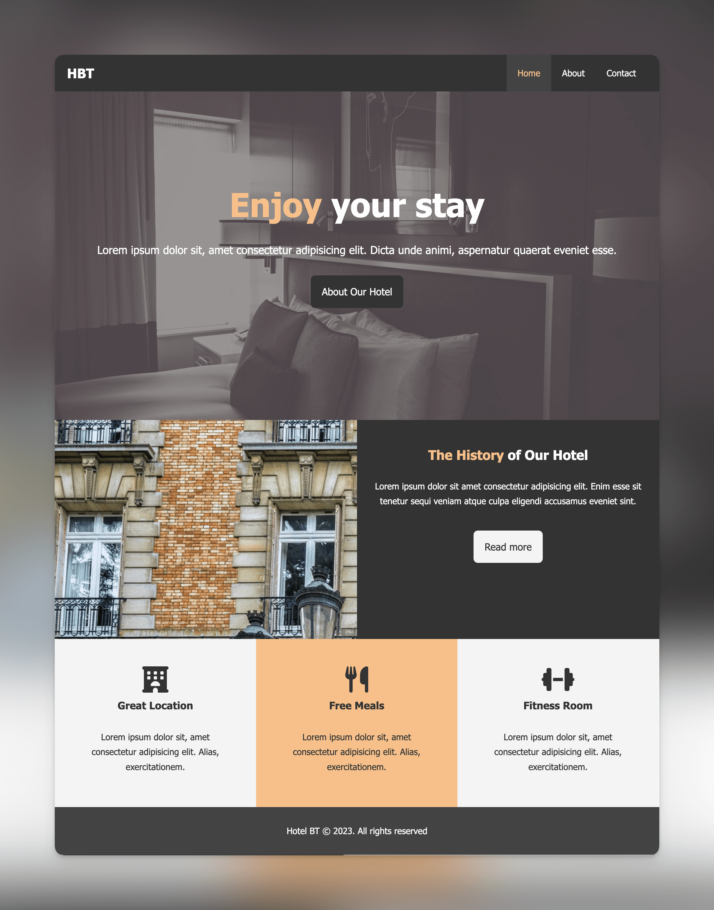
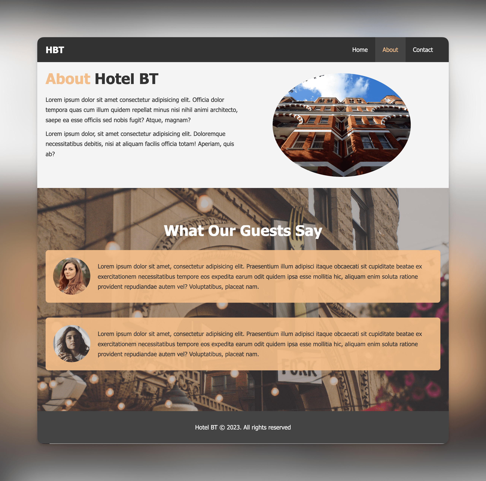
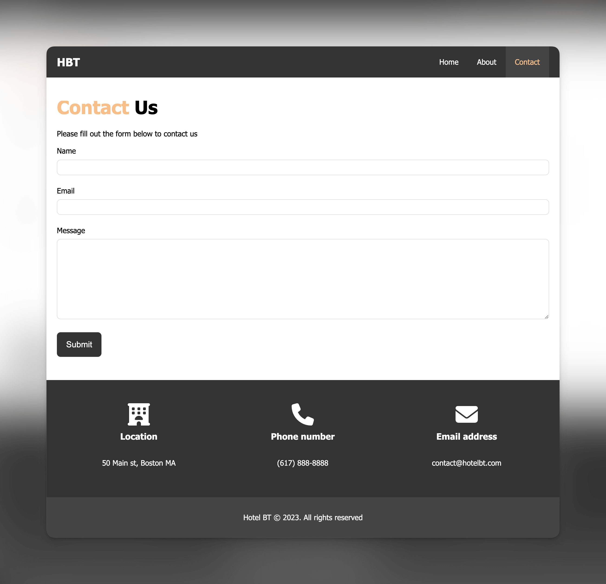

## Hotel BT: A Mini Hotel Website

### Overview

Hotel BT is the first project in the "Modern HTML and CSS Course" by Traversy Media. The goal of this project is to apply foundational knowledge of HTML and CSS learned from earlier lessons.

### Technologies Used

- **HTML**: For structuring the web pages
- **CSS**: For styling and layout

### Features

- Basic hotel information sections
- Simple, clean UI

### Implementation Details

This project exclusively utilizes plain HTML and CSS. For layout and positioning, the project relies on the CSS `float` property. This means that the site is not fully responsive due to the constraints of using floats for layout.

### Resources

- Images sourced from **Pexels** and **Unsplash**
- Icons courtesy of the free version of **Font Awesome**

### Screenshots

